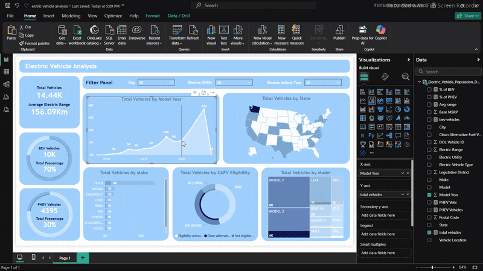

# 🚗💫 Electric Vehicle Analysis Dashboard 

Welcome to my **Electric Vehicle Analysis Dashboard** project! This is my very first Power BI dashboard, created as part of my self-learning journey into data visualization and analytics.

---

## About This Project

This project showcases my ability to take raw data and turn it into meaningful insights through interactive visualizations. It was a deep dive into Power BI, and it helped me learn the full pipeline of dashboard creation — from data cleaning to design aesthetics.

---

## Key Learnings & Features

- ✅ End-to-end dashboard development workflow  
- ✅ Data cleaning and transformation using Power Query  
- ✅ Creating KPIs and insightful charts  
- ✅ Implementing slicers and interactive filters for user-driven exploration  
- ✅ Applying background themes and design elements for a polished look  

---

## Skills Gained

- Power BI Desktop proficiency  
- Data preparation and transformation with Power Query  
- Writing DAX formulas for calculated columns and measures  
- Designing user-friendly, interactive dashboards  
- Data storytelling through visualization best practices  
- Problem-solving in data cleaning and visualization design  
- Enhancing user experience with slicers and filters  

---

## Preview

Here’s a quick preview of the dashboard in action:

  

---

## Technologies & Tools Used

- **Power BI Desktop**  
- **Power Query** for data cleaning  
- **DAX** for calculated measures and KPIs  
- Visual elements including bar charts, line charts, and slicers  

---

